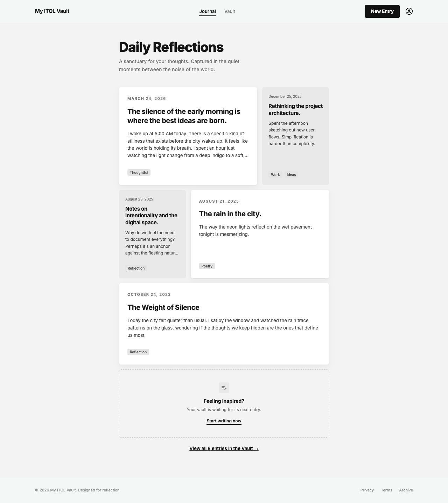

# My ITOL Vault

A multi-page digital diary built with HTML, CSS and JavaScript for the IT Online Learning JavaScript assignment. You write a reflection, save it, and it's still there when you close the browser and come back, because every entry is saved with the Web Storage API (`localStorage`).



## Pages

| Page | What it does |
|---|---|
| `index.html` (Journal) | **Daily Reflections**: the 5 most recent entries in a grid of large and small cards, a "Feeling inspired?" link to write a new one, and a link to the full vault |
| `new-entry.html` (Editor) | A form with an `<input>` for the title and a `<textarea>` for the reflection, plus tags, **Insert Memory** (adds a writing prompt), **Private**, **Discard** and **Save Entry** |
| `vault.html` (My Vault) | **Every** entry in full-width rows, newest first. Long entries have **Read more**, and the **•••** menu deletes an entry |

The **New Entry** button, the **profile icon** and the **Journal** / **Vault** links are all `<a>` tags, so you can move between the pages from anywhere.

## Features

- **Entries survive closing the browser**, because they're saved in `localStorage`.
- **Responsive:** CSS Grid for the home cards (three columns on a computer, one on a phone) and Flexbox for the header, rows, toolbar and footer.
- **Empty states:** with no entries, the home page and vault say so and offer **Add sample entries**, which loads the entries from the design.
- **Validation:** an empty reflection isn't saved and shows a message. A missing title becomes "Untitled Reflection".
- **Private entries** hide their text on the home page and show a 🔒 label in the vault.
- **Safe with any text:** entries are shown with `textContent`, so typing HTML like `<b>` shows the characters instead of running as code.
- **Accessible:** labelled inputs, a skip link, `aria-current` on the current page, `aria-pressed` on the Private button and `aria-expanded` on menus.

## How the JavaScript works

| File | Job |
|---|---|
| `js/storage.js` | Shared by all three pages: `getEntries()`, `saveEntries()`, `getNewestFirst()`, date formatting and the sample entries |
| `js/new-entry.js` | Reads the form and saves the new entry (Milestones 2 and 3) |
| `js/home.js` | Shows the 5 most recent entries (Milestone 4) |
| `js/vault.js` | Shows every entry, with Read more and Delete (Milestone 5) |

### Saving an entry

1. `document.querySelector` selects the form and the **Save Entry** button, and `addEventListener("click", ...)` listens for the click.
2. The text comes out of the inputs with `.value` and is logged to the console.
3. A new entry object is built: `{ id, title, body, tags, isPrivate, createdAt }`.
4. The saved array is read, the new object is `push`ed onto it, and the whole array is saved with `localStorage.setItem("entries", JSON.stringify(entries))`. `localStorage` can only store strings, so `JSON.stringify` turns the array into one.

### The "5 most recent entries" logic

In `js/home.js`, `renderRecentEntries()` does this:

1. **Read the data.** `getEntries()` runs `JSON.parse(localStorage.getItem("entries"))` to turn the saved string back into an array. It returns an empty array if nothing is saved yet, or if the data is broken.
2. **Put the newest first.** `push` adds each new entry to the **end** of the array, so the oldest entries are at the start. `getNewestFirst()` sorts a copy by each entry's `createdAt` date, newest first. Sorting by the date, instead of trusting the order in storage, keeps it right even if older entries (like the samples) are added later.
3. **Clear the placeholders.** `entryGrid.textContent = ""` removes the 5 hard-coded cards from the HTML.
4. **Take the first 5.** `entries.slice(0, 5)` returns a new array holding only the 5 newest entries. It doesn't change the original array, which `vault.html` still uses in full.
5. **Build the cards.** `forEach` loops through those 5 and uses `document.createElement` to build each card, then adds it to the grid with `appendChild`.
6. **Link to the rest.** If there are more than 5 entries, a "View all N entries in the Vault" link appears.

The grid layout is pure CSS: `:nth-child(4n + 1)` and `:nth-child(4n + 4)` make the 1st, 4th and 5th cards large (two columns, white) and the others small (one column, grey), matching the design.

`vault.html` does the same steps **without** `slice`, so every entry is shown.

## localStorage

- [MDN: Window.localStorage](https://developer.mozilla.org/en-US/docs/Web/API/Window/localStorage)
- [MDN: Using the Web Storage API](https://developer.mozilla.org/en-US/docs/Web/API/Web_Storage_API/Using_the_Web_Storage_API)

`localStorage` saves data in the browser with no expiry date, as key and value pairs of strings. It's shared by every page on the same site, which is why an entry saved on `new-entry.html` can be read on `index.html` and `vault.html`. To see the saved data, open DevTools (F12), go to **Application**, then **Local storage**, and look at the `entries` key.

## Run it

Open `index.html` in a browser. Or run a local server from this folder:

```text
python3 -m http.server 8000
```

Then visit `http://localhost:8000`. Entries are saved per browser and per site address, so entries saved on `localhost` won't appear on the live site.

## Screenshots

| Page | Computer | Phone |
|---|---|---|
| Journal | [home.png](screenshots/home.png) | [home-mobile.png](screenshots/home-mobile.png) |
| New Entry | [new-entry.png](screenshots/new-entry.png) | [new-entry-mobile.png](screenshots/new-entry-mobile.png) |
| Vault | [vault.png](screenshots/vault.png) | [vault-mobile.png](screenshots/vault-mobile.png) |
