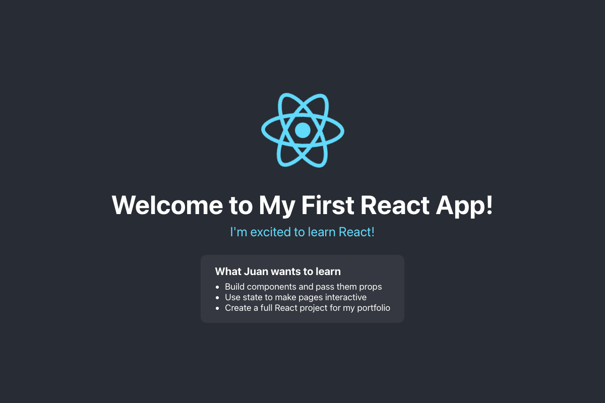

# Practical Activity: Setting Up Your React Development Environment

My first React app, made with Create React App. It shows a personalised welcome message and a `Goals` component I made in its own file.



## What I did

| Step | Done |
|---|---|
| **1. Node.js and npm** | Checked with `node --version` (v24.16.0) and `npm --version` (11.13.0) |
| **2. Code editor** | Visual Studio Code |
| **3. Create React App** | Ran it with `npx`, which downloads and runs the latest version without a global install. The Create React App docs recommend this over `npm install -g create-react-app` |
| **4. Create the app** | `npx create-react-app my-first-react-app` |
| **5–7. Run it** | `cd my-first-react-app`, then `npm start`, then open `http://localhost:3000` |
| **8–9. Edit `src/App.js`** | Changed it to show "Welcome to My First React App!" and "I'm excited to learn React!" |
| **10. Automatic update** | Saving `App.js` updates the page in the browser straight away, without a manual reload |

## Bonus challenges

- **New component in a separate file:** `src/Goals.js` takes a `name` prop and lists my React goals with `.map()`. `App.js` imports it with `import Goals from './Goals';` and uses it as `<Goals name="Juan" />`.
- **Tests:** I updated `src/App.test.js` (the default test looked for the "Learn React" link I removed). It now checks the welcome message and the Goals list. Run it with `npm test`.
- **Project structure:**

| File or folder | What it's for |
|---|---|
| `public/index.html` | The only HTML page. React puts the whole app inside its `<div id="root">`. I changed its `<title>` to "My First React App" |
| `src/index.js` | The starting point: it renders `<App />` into the root div |
| `src/App.js` | The main component, where I made my changes |
| `src/Goals.js` | My own component |
| `src/App.css` | Styles for App and Goals |
| `src/App.test.js` | Tests for App |
| `package.json` | The app's name, its packages and its scripts (`start`, `build`, `test`) |
| `node_modules/` | The installed packages. It isn't saved to GitHub: `npm install` gets them back |

- **React Developer Tools:** install the [browser extension](https://react.dev/learn/react-developer-tools), open DevTools on `localhost:3000` and pick the **Components** tab to see `App` and `Goals`, with the `name` prop.

## Run it

```text
cd my-first-react-app
npm install
npm start
```

`npm install` is only needed the first time, for example after cloning from GitHub.

## Note

The React team deprecated Create React App in 2025. It still works, and it's what this course uses, but new projects usually use Vite (`npm create vite@latest`).
