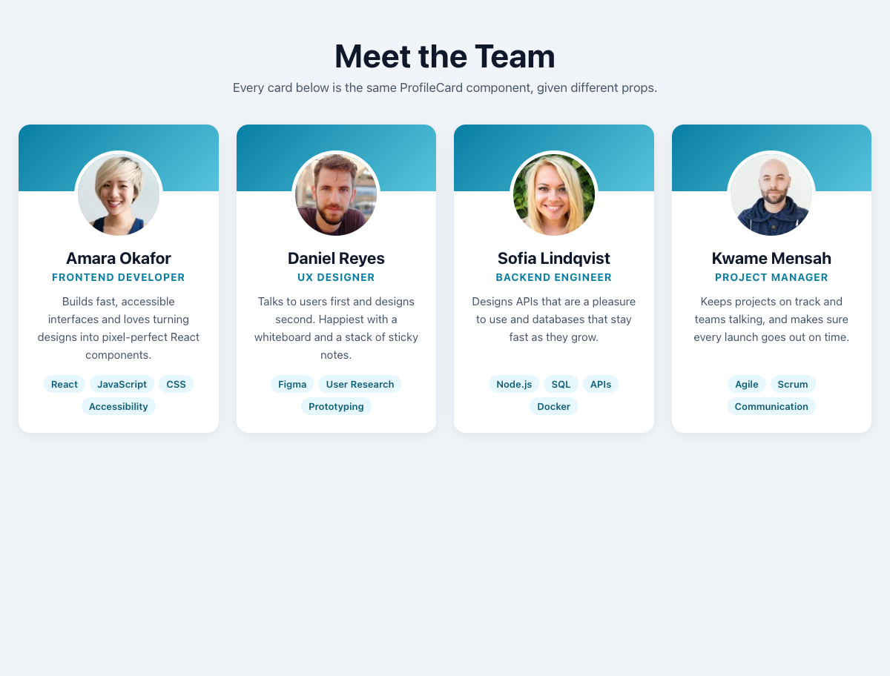

# Practical Activity: Building a Reusable Card Component

A reusable `ProfileCard` React component. `App` shows a team of four people, and every card is the same component with different props.



## Where each step is

| Step | Where to look |
|---|---|
| **ProfileCard component** | `profile-cards/src/components/ProfileCard.js` |
| **Props** | `image`, `name`, `jobTitle` and `bio`, taken out of the props with destructuring: `function ProfileCard({ image, name, jobTitle, bio, skills = [] })` |
| **Layout and CSS** | `src/components/ProfileCard.css`: a coloured banner, a round photo that overlaps it, the name, job title, bio and skill tags. The card lifts when you hover over it |
| **Array of profiles** | `src/App.js`: four profile objects in a `profiles` array |
| **`.map()`** | `profiles.map((profile) => <ProfileCard key={profile.id} ... />)` renders one card per profile |
| **Page layout** | `src/App.css`: a CSS Grid that fits as many cards per row as the screen allows |
| **Bonus: skills** | A `skills` array prop, shown as tags with another `.map()`. It defaults to `[]`, and the tags only appear when there are skills (`skills.length > 0 &&`) |

## Extras

- **Photo fallback:** if a photo doesn't load, the card shows the person's initials instead (`onError` and `useState`).
- **Alt text** on every photo: "Portrait of Amara Okafor".
- **Tests** in `src/App.test.js` check there's one card per profile, that the props and skills show, and the initials fallback. Run them with `npm test`.

The photos are sample portraits from [randomuser.me](https://randomuser.me/), and the people are made up.

## Run it

```text
cd profile-cards
npm install
npm start
```

Then open `http://localhost:3000`.
