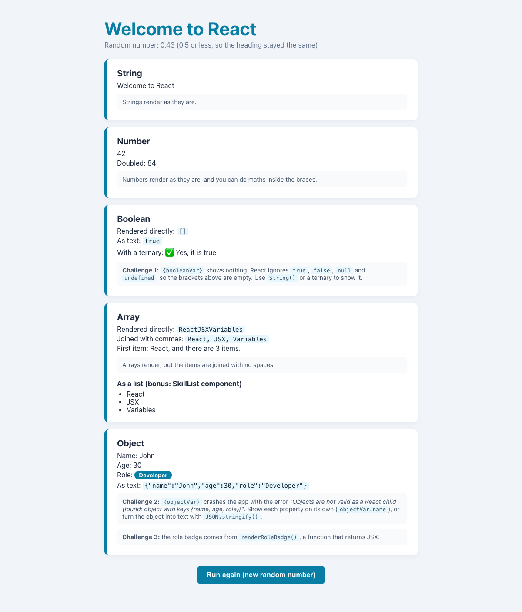

# Practical Activity: Working with React JSX, Variables, and Objects

A `VariableDisplay` component that creates a string, a number, a boolean, an array and an object, then shows each one in JSX, including the types JSX can't show directly.



## Where each step is

All in `variable-display/src/VariableDisplay.js`:

| Step | What I did |
|---|---|
| **1–2. Component and variables** | `stringVar`, `numberVar`, `booleanVar`, `arrayVar` and `objectVar` (name, age and role), from the starter template |
| **3. Display them** | One card per type, with each variable in `{ }` |
| **4. Random condition** | `if (Math.random() > 0.5)` changes the heading to "Welcome to advanced React". The page shows the random number and which way it went. **Run again** creates the component again, so you can see both results |
| **5. Each type** | Every card shows what happens when you render that type, and how to show it properly |

## Challenges

1. **Rendering the boolean:** `{booleanVar}` shows **nothing**. React ignores `true`, `false`, `null` and `undefined`. `String(booleanVar)` or a ternary shows it.
2. **Rendering the whole object:** `{objectVar}` crashes the app with *"Objects are not valid as a React child (found: object with keys {name, age, role})"*. The fix is to show each property (`objectVar.name`), or use `JSON.stringify(objectVar)`.
3. **A function that returns JSX:** `renderRoleBadge()` returns a `<span>`, called inside the JSX as `{renderRoleBadge()}`.

**Arrays** render, but joined with no spaces (`ReactJSXVariables`). `arrayVar.join(', ')` adds commas.

## Bonus

`src/SkillList.js` takes the array as an `items` prop and renders each one as an `<li>` with `.map()`.

## Tests

`src/App.test.js` fakes `Math.random()` to test both headings, checks the object properties and list, and checks that **Run again** picks a new number. Run them with `npm test`.

## Run it

```text
cd variable-display
npm install
npm start
```
