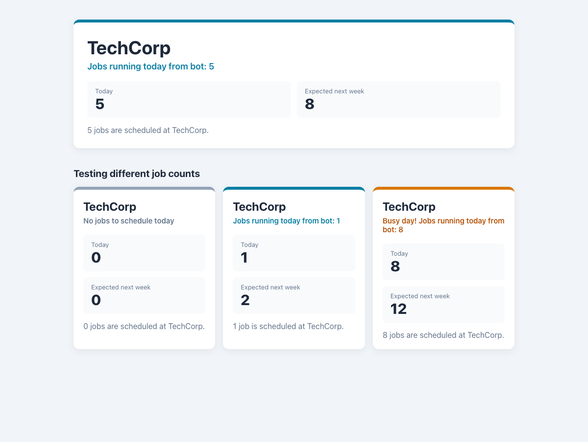

# Practical Activity: Dynamic Job Board with JSX Expressions

A `JobBoard` component that shows a company name and a message that changes with the number of jobs.



## Where each task is

All in `job-board/src/JobBoard.js`:

| Task | Code |
|---|---|
| **1. Company name in `{ }`** | `<h1>{companyName}</h1>` |
| **2. `getJobMessage()`** | An `if / else if / else` that returns "No jobs to schedule today" for 0 jobs, or a template literal: `` `Jobs running today from bot: ${jobCount}` `` |
| **3. Call it in JSX** | `<p>{getJobMessage()}</p>` |
| **4. Test different values** | `App.js` shows the main board (TechCorp, 5 jobs), then boards with 0, 1 and 8 jobs, so every message can be seen at once |

`companyName` and `jobCount` start as `"TechCorp"` and `5`, like the starter template. They're props with default values (`({ companyName = 'TechCorp', jobCount = 5 })`), so `App` can make the test boards with `<JobBoard jobCount={0} />`.

## Bonus challenges

1. **A calculation:** "Expected next week" is `Math.round(jobCount * 1.5)`. 5 jobs gives 7.5, which rounds to 8.
2. **A more complex condition:** three messages: 0 jobs, 1–5 jobs, and "Busy day!" for more than 5. Each has its own colour, from a ternary that sets the CSS class.

There's also a ternary for grammar: "1 job is" versus "5 jobs are".

## Tests

`src/App.test.js` checks the message and forecast for 5, 0, 8 and 1 jobs. Run them with `npm test`.

## Run it

```text
cd job-board
npm install
npm start
```
