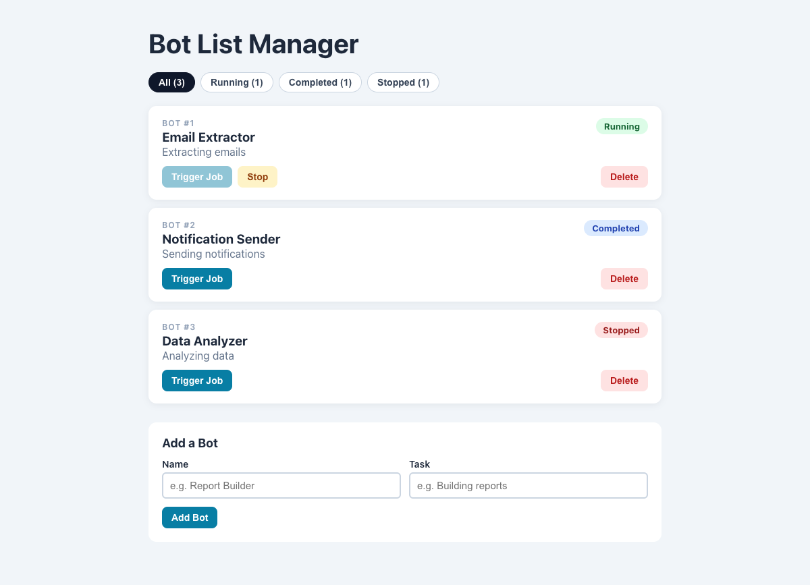

# Practical Activity: Dynamic Bot List Manager

A `BotListManager` that keeps a list of bots in state, lets you trigger and stop jobs, and has all three bonuses: adding, filtering and deleting bots.

## Where each task is

In `bot-list-manager/src/BotListManager.js`:

| Task | Code |
|---|---|
| **1. Map the bots** | `visibleBots.map((bot) => <li ...>)` |
| **2. Unique keys** | `key={bot.id}` on each `<li>` |
| **3. ID, name, status and task** | "Bot #1", the name as a heading, the task underneath, and a status badge |
| **4. triggerJob** | Sets the bot's status to **Running** with `bots.map(...)` and a copied object `{ ...bot, status }`, so state is never changed directly. **Trigger Job** is disabled while a bot is running, and a **Stop** button appears |
| **5. Status colours** | `className={`status status--${bot.status.toLowerCase()}`}`: green for Running, blue for Completed, red for Stopped |
| **6. CSS** | `src/BotListManager.css`: cards with shadows, pill badges and filter buttons |

## Bonus challenges

1. **Add a bot:** a form with a name and a task. Empty fields show an error. New bots get the next id and start as Stopped.
2. **Filter by status:** All / Running / Completed / Stopped buttons, each with a count, using `bots.filter(...)`.
3. **Delete a bot:** `setBots(bots.filter((bot) => bot.id !== id))`.

## Tests and running it

`src/App.test.js` checks the list, trigger and stop, filtering, adding and deleting. In `bot-list-manager`, run `npm install` once, then `npm test` or `npm start`.
