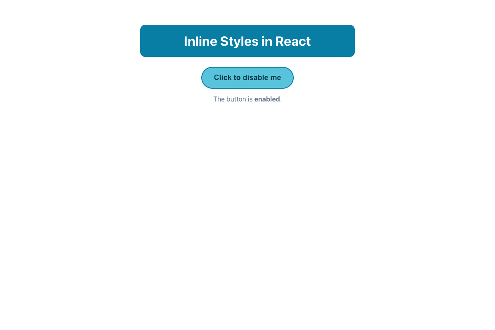

# Practical Activity: Styling React Components with Inline Styles

A `StyledButton` component with a styled heading and a button, styled only with React's `style` attribute.

## Where each task is

All in `styled-button/src/StyledButton.js`:

| Task | Code |
|---|---|
| **1. Heading style object** | `headingStyle`: `textAlign: 'center'`, `color`, `backgroundColor` (plus padding and rounded corners) |
| **2. Button style object** | `buttonStyle`: `padding`, `backgroundColor`, `color`, `border` and `borderRadius` |
| **3. Apply them** | `<h1 style={headingStyle}>` and `<button style={combinedButtonStyle}>` |
| **4. Disable from a variable** | `const startsDisabled = false;` sets the starting value, and `disabled={isDisabled}` on the button. Change it to `true` to start disabled |
| **5. className** | `className="styled-button"` (JSX uses `className`, not `class`) |

All the CSS property names are camelCase: `backgroundColor`, not `background-color`.

## Bonus challenges

1. **Changing isDisabled on click:** `isDisabled` is state. `handleClick` sets it to `true`, so the button disables itself. A disabled button can't be clicked, so an **Enable it again** button appears.
2. **Hover with JavaScript:** inline styles can't use `:hover`, so `onMouseEnter` and `onMouseLeave` set `isHovered`, which adds `hoverStyle`.
3. **Combining style objects:** `{ ...buttonStyle, ...(isHovered ? hoverStyle : {}), ...(isDisabled ? disabledStyle : {}) }`. Later objects win, so the disabled look beats the hover look.

## Inline styles versus CSS

| CSS file | Inline style in React |
|---|---|
| `background-color: blue;` | `backgroundColor: 'blue'` |
| Semicolons between rules | Commas between properties (it's an object) |
| Supports `:hover`, media queries and animations | Doesn't: use events and state, or a CSS file |

## Tests and running it

`src/App.test.js` checks the styles, the className, hovering, and disabling and enabling. In `styled-button`, run `npm install` once, then `npm test` or `npm start`.
