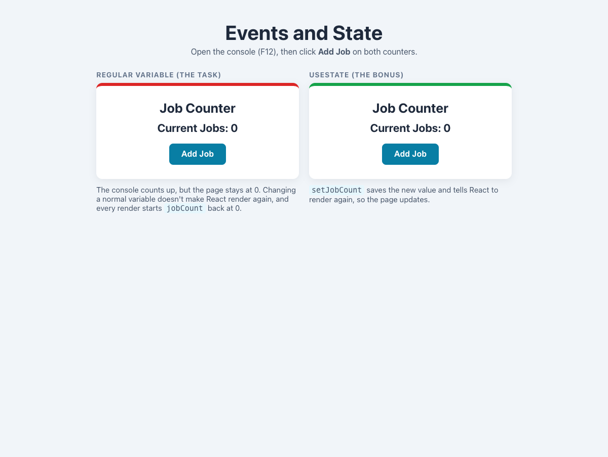

# Practical Activity: Interactive Job Counter with Events

A `JobCounter` that uses a regular variable, as the task asks, so it shows why React needs state. The bonus `useState` version sits next to it for comparison.

## Where each step is

In `job-counter/src/JobCounter.js`:

| Step | Code |
|---|---|
| **Heading, paragraph and button** | `<h1>Job Counter</h1>`, `
Current Jobs: {jobCount}
` and `<button>Add Job</button>` |
| **The variable** | `let jobCount = 0;` |
| **handleAddJob** | Adds 1 to `jobCount` and logs it: `console.log('Job count is now:', jobCount)` |
| **onClick** | `<button onClick={handleAddJob}>` |

## What happens (task 4)

Clicking **Add Job** three times logs 1, 2 and 3 in the console, but the page still says **Current Jobs: 0**.

## Discussion points

1. **Why doesn't the page update?** React only renders a component again when its state or props change. Changing a normal variable doesn't tell React anything. Even if the component did render again, the function would run from the top and set `let jobCount = 0` again.
2. **Regular variable versus state:** a regular variable is created fresh on every render and changing it does nothing to the page. State is remembered by React between renders, and changing it with its setter makes React render again.
3. **How state fixes it:** the bonus, `src/JobCounterWithState.js`, uses `const [jobCount, setJobCount] = useState(0)` and `setJobCount(jobCount + 1)`, so the number on the page goes up with every click.

## Tests and running it

`src/App.test.js` proves both: the variable version logs 3 but still shows 0, and the `useState` version shows 2 after two clicks. In `job-counter`, run `npm install` once, then `npm test` or `npm start`, and open the console (F12).
