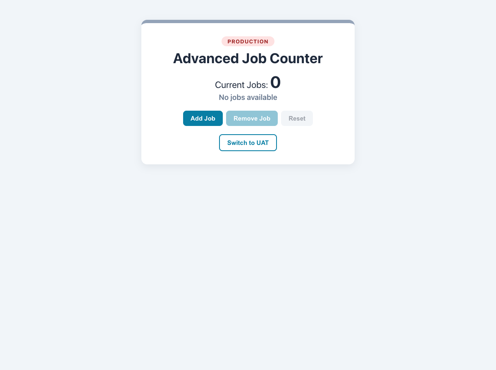

# Practical Activity: Job Counter with useState

An `AdvancedJobCounter` that adds, removes and resets jobs with the `useState` hook, shows a message for the number of jobs, and switches between Production and UAT.

## Where each task is

All in `advanced-job-counter/src/AdvancedJobCounter.js`:

| Task | Code |
|---|---|
| **1. State** | `const [jobCount, setJobCount] = useState(0);` |
| **2. Add** | `setJobCount((previous) => previous + 1)` |
| **3. Remove, never below 0** | `setJobCount((previous) => Math.max(previous - 1, 0))`. The button is also disabled at 0 |
| **4. Reset** | `setJobCount(0)` |
| **5. Buttons** | **Add Job**, **Remove Job** and **Reset**, each with `onClick` |
| **6. Messages** | An `if / else if / else`: "No jobs available" (0), "Few jobs available" (1–5), "Many jobs available" (more than 5). The card's colour changes too |

State is only ever changed through `setJobCount`, never directly. The `previous =>` form always uses the latest value.

## Bonus challenges

1. **Environment state:** `const [environment, setEnvironment] = useState('Production');`
2. **Toggle button:** **Switch to UAT** / **Switch to Production**.
3. **Shown with the count:** a coloured Production or UAT badge at the top.

## Tests and running it

`src/App.test.js` checks adding, removing, resetting, the three messages, never going below 0, and the environment toggle. In `advanced-job-counter`, run `npm install` once, then `npm test` or `npm start`.
