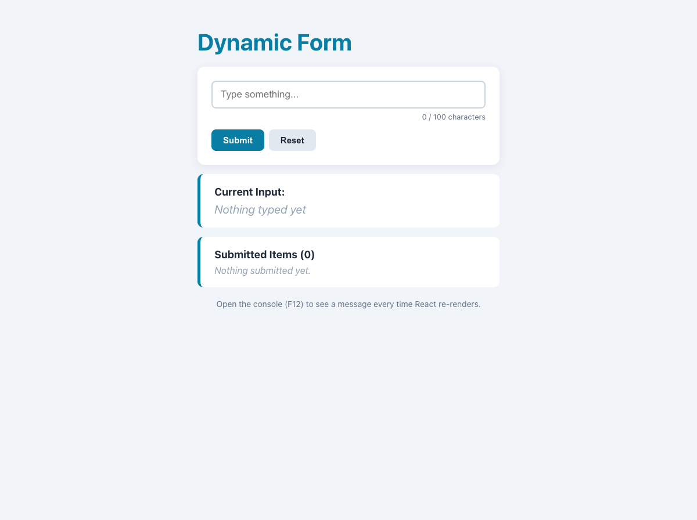

# Practical Activity: Dynamic Input Form with useState

A `DynamicForm` that shows what you type as you type it, with reset, a character count, validation and a list of submitted items.

## Where each task is

All in `dynamic-form/src/DynamicForm.js`:

| Task | Code |
|---|---|
| **1. State for the input** | `const [inputValue, setInputValue] = useState('');` |
| **2. handleInputChange** | `setInputValue(event.target.value)`, connected with `onChange` |
| **3. handleReset** | `setInputValue('')` |
| **4. Real-time display** | "Current Input" shows `{inputValue}` below the form |
| **5. Re-render logs** | `console.log('DynamicForm rendered...')` in the component body runs on every render. The handlers log too, so the console shows: onChange, then a render |

## Bonus challenges

1. **Character count:** `{inputValue.length} / 100 characters`, updating on every keystroke.
2. **Submit to a list:** `submittedItems` state. Submitting adds a copy with `[...submittedItems, trimmed]` and clears the input.
3. **Validation:** under 3 characters shows "Please type at least 3 characters." and the input gets a red border.

## Tests and running it

`src/App.test.js` checks the live display and count, the render log, reset, the validation error and submitting. In `dynamic-form`, run `npm install` once, then `npm test` or `npm start`, and open the console (F12) to watch the re-renders.
