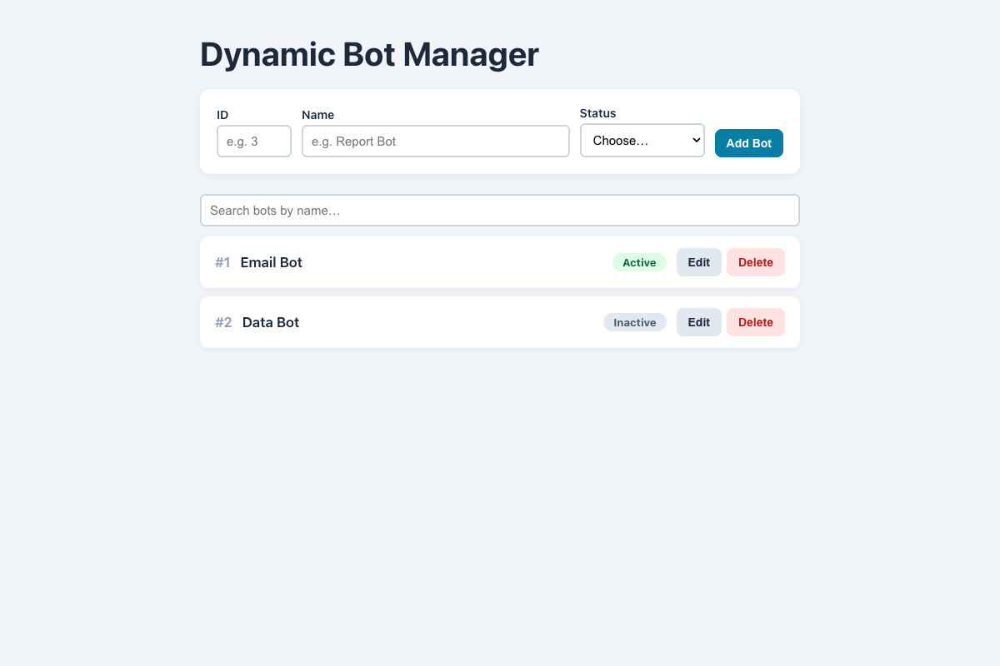

# Practical Activity: Dynamic Bot List Manager with Add and Delete

A `DynamicBotManager` that adds bots from a form, lists them, deletes them, and has the edit and search bonuses.

## Where each task is

All in `dynamic-bot-manager/src/DynamicBotManager.js`:

| Task | Code |
|---|---|
| **State** | `bots` (the list) and `newBot` (`{ id, name, status }` while typing) |
| **1. handleInputChange** | `const { name, value } = e.target; setNewBot({ ...newBot, [name]: value });`. Each input's `name` says which field to change |
| **2. Inputs** | ID and Name inputs, and a Status dropdown (Active / Inactive), all connected to `handleInputChange` |
| **3. addBotToList** | Checks every field is filled, then `setBots([...bots, bot])`. It also refuses a duplicate ID, because IDs are used as React keys |
| **4 and 6. deleteBot** | `setBots(bots.filter((bot) => bot.id !== id))` |
| **5. The list** | `bots.map(...)`, each with a status badge and a **Delete** button: `onClick={() => deleteBot(bot.id)}` |
| **7. Clear the inputs** | `setNewBot(EMPTY_BOT)` after adding |

**The spread operator:** `[...bots, bot]` and `{ ...newBot, [name]: value }` make new copies, so React sees the change.

**Arrow functions:** `onClick={() => deleteBot(bot.id)}` waits for the click and passes that bot's id. Arrow functions also have no `this` of their own, so there's no `this` binding to go wrong.

## Bonus challenges

1. **Validation:** an error message for empty fields or a duplicate ID.
2. **Edit:** **Edit** turns a row into inputs, with **Save** and **Cancel**. Saving uses `bots.map(...)`.
3. **Search:** a search box filters the list by name.

## Tests and running it

`src/App.test.js` checks the starting list, validation, adding and clearing, deleting, editing and searching. In `dynamic-bot-manager`, run `npm install` once, then `npm test` or `npm start`.
