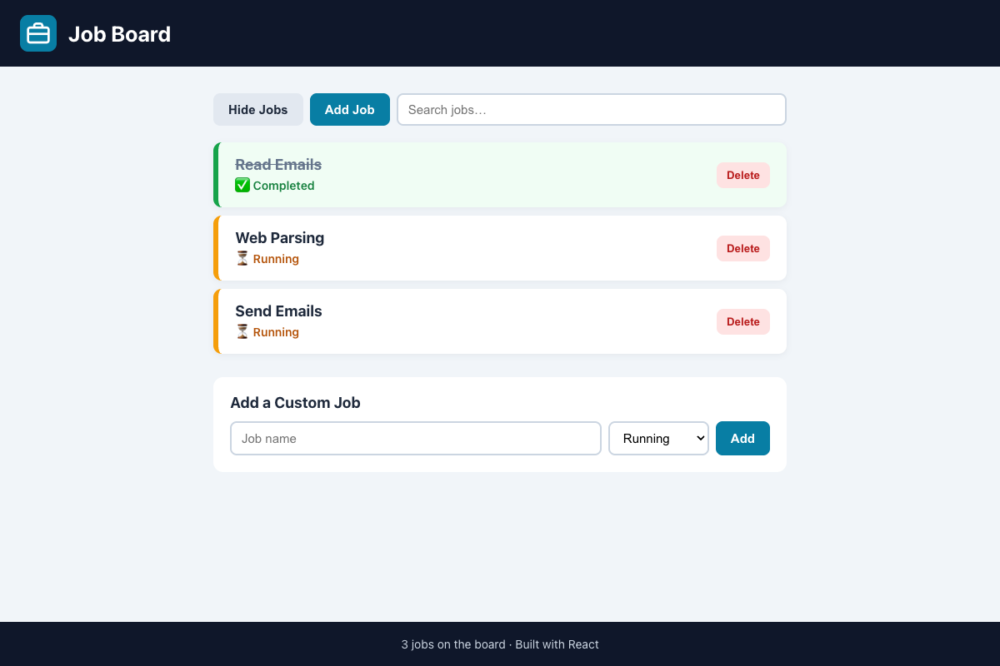

# Practical Activity: Building a Modular Job Board Application

A job board built from four components (`Header`, `Footer`, `JobList` and `JobItem`), with a show/hide toggle, an **Add Job** button, and all three bonuses.

## Components

| Component | File | What it does |
|---|---|---|
| **Header** | `src/components/Header.js` | Task 1: a logo image (`src/assets/logo.svg`, imported) and the title, passed as a prop |
| **JobList** | `src/components/JobList.js` | Task 2: maps the `jobs` prop to `JobItem`s, or shows "No jobs to show." |
| **JobItem** | `src/components/JobItem.js` | Task 3: one job. Completed jobs get a green border, a crossed-out name and ✅. Running jobs get an orange border and ⏳ |
| **Footer** | `src/components/Footer.js` | The number of jobs, passed as a prop |
| **App** | `src/App.js` | Holds the state and puts everything together |

## Tasks in App

| Task | Code |
|---|---|
| **4. Show / hide** | `showJobs` state, a **Hide Jobs** / **Show Jobs** button, and `{showJobs && <JobList ... />}` |
| **5. Styling** | `src/App.css`, with different styles for each status |
| **6. Add Job** | Adds "New Job 4", "New Job 5"... with `setJobs([...jobs, newJob])` |

## Bonus challenges

1. **Delete:** each `JobItem` gets `onDelete` as a prop and calls it with its id.
2. **Search:** filters the jobs by name as you type.
3. **Custom job form:** a name and a status (Running / Completed).

**Why this is efficient:** when you hide the list, React only removes the list from the page. The header, toolbar and footer aren't redrawn. Changing the DOM by hand, you'd have to find and update those elements yourself.

## Tests and running it

`src/App.test.js` checks the components, the status styles, hide/show, adding, deleting, the form and search. In `modular-job-board`, run `npm install` once, then `npm test` or `npm start`.
