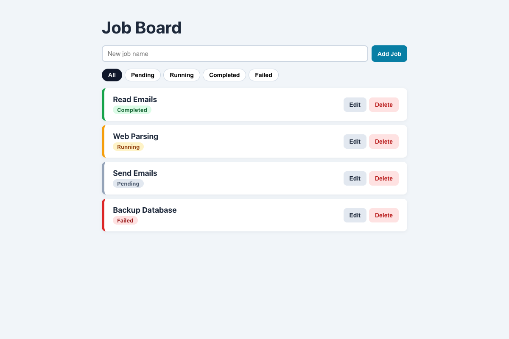

# Practical Activity: Building a Modular Job Board with Props

A job board where `App` owns the jobs, passes them **down** to `JobList` and `JobItem` as props, and passes the delete and edit functions down too, so actions come back **up**.

## Where each task is

| Task | Where |
|---|---|
| **1. handleDeleteJob** | `src/App.js`: `setJobs(jobs.filter((job) => job.id !== id))` |
| **2. JobList** | `src/components/JobList.js`: maps `jobs` to `<JobItem job={job} onDelete={onDeleteJob} ... />` |
| **3. JobItem** | `src/components/JobItem.js`: shows the name and status, a **Delete** button that calls `onDelete(job.id)`, and a class from the status (`job-item--failed` and so on) |
| **4. Keys** | `key={job.id}` on each `JobItem` in the list, using the job's unique id |
| **5. Add jobs** (optional) | A form in `App` that adds a Pending job |

**One-way data flow:** only `App` changes `jobs`. `JobItem` can't change it directly. It calls the function it was given.

## Bonus challenges

1. **Missing props:** `JobList` defaults to `jobs = []` and checks it's an array. `JobItem` returns nothing without a `job`, uses "Untitled job" without a name, and has do-nothing default functions, so a missing `onDelete` can't crash it.
2. **Edit:** **Edit** turns a job into a form. **Save** sends the edited copy up with `onEdit`, and `App` swaps it in with `map`.
3. **Filter:** All / Pending / Running / Completed / Failed buttons.

## Tests and running it

`src/App.test.js` checks the list and status classes, delete, add, edit, filter, and rendering with missing props. In `job-board-props`, run `npm install` once, then `npm test` or `npm start`.
