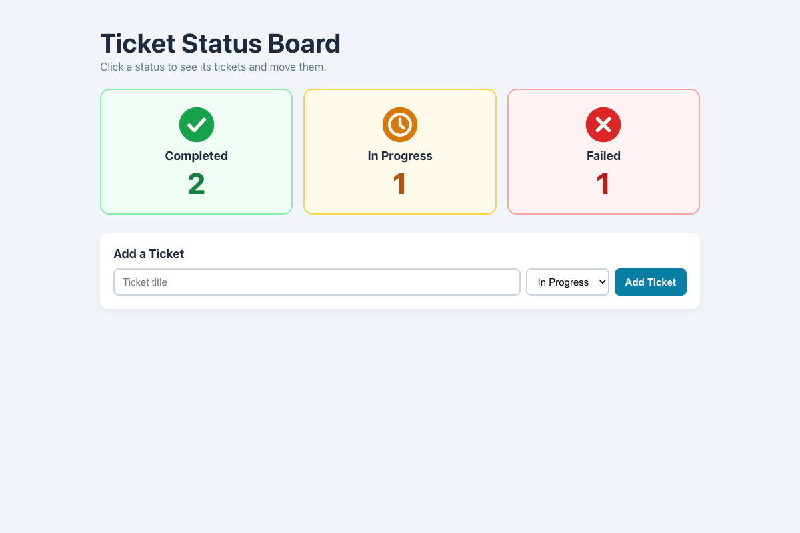

# Practical Activity: Building a Status Board with Dynamic Components

A `StatusBoard` with three `TicketInfo` cards (Completed, In Progress and Failed), each showing an icon, its status text through `props.children`, and a count.

## Where each task is

| Task | Where |
|---|---|
| **1. StatusBoard** | `src/components/StatusBoard.js`: imports the three icons from `src/assets`, and renders one `TicketInfo` for each status with `result` and `image` props. The status text goes between the tags: `<TicketInfo ...>Completed</TicketInfo>` |
| **2. TicketInfo** | `src/components/TicketInfo.js`: shows the `image` and `{children}`. The `result` prop sets the class: `ticket-info--completed`, `--in-progress` or `--failed` |
| **3. CSS** | `StatusBoard.css` puts the cards side by side with flexbox (they wrap on a phone). `TicketInfo.css` gives each status its own border and background |
| **4. Counts** (optional) | `count={ticketsWith(column.result).length}`, worked out from the tickets in state |

## Bonus challenges

1. **Click for details:** each card is a button. Clicking it lists the tickets in that status.
2. **Add tickets:** a form with a title and a status. The counts update by themselves, because they're worked out from the ticket list.
3. **Animation:** each ticket in the details has a status dropdown. Moving a ticket changes the counts, and the number pops. The count's `key` changes with its value, so React draws it again and the CSS animation replays. It's turned off for people who prefer reduced motion.

## Tests and running it

`src/App.test.js` checks that `TicketInfo` shows its children and class, the counts, the details, adding a ticket and moving one. In `status-board`, run `npm install` once, then `npm test` or `npm start`.
