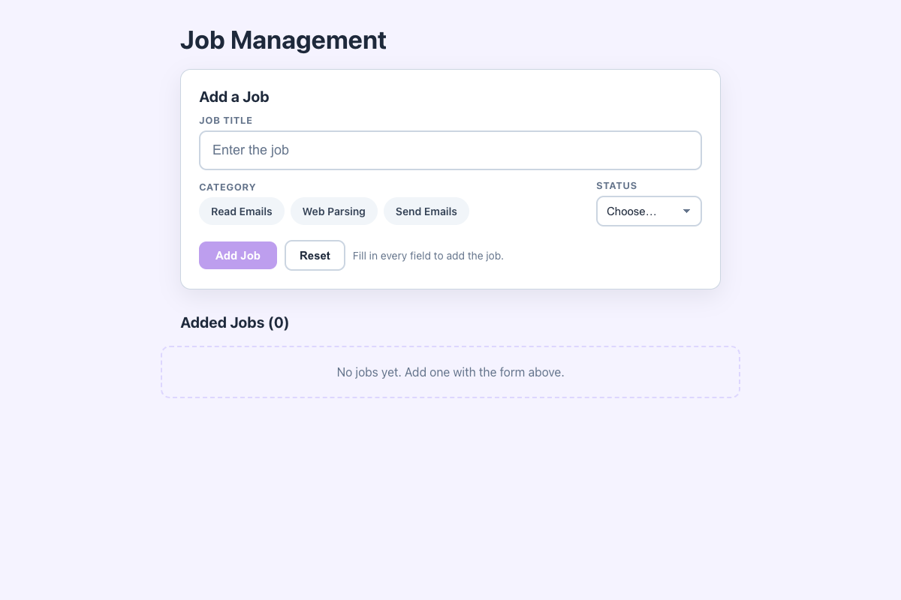

# Practical Activity: Enhancing Form Handling in the Job Management Application

The Job Management form with full form handling: one state object, one change handler, validation, reset, success messages and a separate `JobList`, plus editing and `localStorage`.

## Where each task is

| Task | Where |
|---|---|
| **1. handleInputChange** | `src/components/JobForm.js`: `const { name, value } = event.target;` then `setJobDetails({ ...previous, [name]: value })`. The title input, the category radio buttons and the status dropdown all have a `name` |
| **2. handleSubmit** | `event.preventDefault()`, then `console.log('Job details:', job)`, hands the job to `App` with `onSave`, and resets |
| **3. Validation** | **Add Job** is `disabled` until every field is valid. A hint says "Fill in every field to add the job." Each field shows its own error once you've left it empty |
| **4. resetForm** | Puts `jobDetails` back to its starting value. The **Reset** button calls it too |
| **5. Success message** | "✅ "Check inbox" was added." in a green box |
| **6. Separate list component** | `src/components/JobList.js` only displays the jobs, with Edit and Delete |

**One job per component:** `JobForm` handles the form, `JobList` shows the jobs, and `App` owns the list and saves it.

## Bonus challenges

1. **Per-field errors:** "Please enter a job title.", "The job title must be at least 3 characters.", "Please choose a category." and "Please choose a status.". Invalid inputs get a red border and `aria-invalid`.
2. **Edit:** **Edit** loads a job into the form, which becomes **Edit Job** with **Save Changes** and **Cancel**.
3. **localStorage:** jobs are saved with `useEffect` and loaded when the app starts.

The categories are radio buttons styled as tags, so they work with the same `handleInputChange` as the other fields and with the keyboard.

## Tests and running it

`src/App.test.js` checks the disabled button, the errors, submitting (log, success, list and reset), reset, editing and saving. In `job-manager-forms`, run `npm install` once, then `npm test` or `npm start`.
