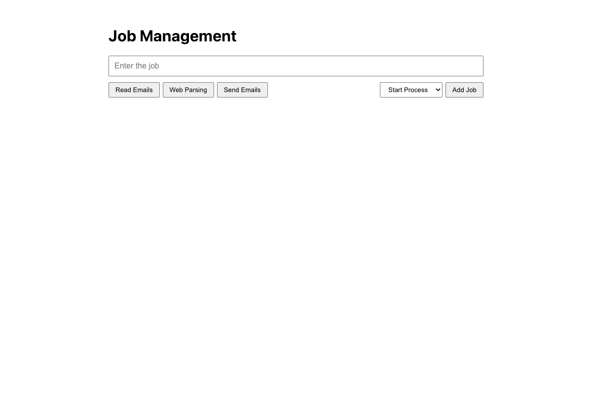

# Practical Activity: Building a Job Management Application Form

The first step of the Job Management app: a `JobForm` component with a job title input, category buttons, a status dropdown and an **Add Job** button. Styling is kept basic, because full styling is the next activity.

## Where each task is

All in `job-form/src/components/JobForm.js`:

| Task | Code |
|---|---|
| **1. Job title input** | `<input type="text" className="bot-input" placeholder="Enter the job" />` |
| **2. Category buttons** | Read Emails, Web Parsing and Send Emails inside `.form-details` > `.bottom-line`. They're `type="button"`, so clicking one doesn't submit the form |
| **3. Status dropdown** | `<select className="job-status">` with Start Process, Running, Completed and Stopped |
| **4. Submit button** | `<button type="submit" className="submit-data">Add Job</button>` |
| **5. Structure** | Everything is inside `
<form>...</form>
` |
| **6. Used in App** | `src/App.js` imports it and renders `<JobForm />` |

## Bonus challenges

1. **State:** `useState` for the title, the chosen category and the status. The chosen category button is highlighted.
2. **Submit handler:** `handleSubmit` stops the page reloading and logs `New job: { title, category, status }` to the console.
3. **Validation:** without a title and a category, it shows "Please enter a job and choose a category." instead of submitting.

## Tests and running it

`src/App.test.js` checks the form elements, the validation and the logged data. In `job-form`, run `npm install` once, then `npm test` or `npm start`.
