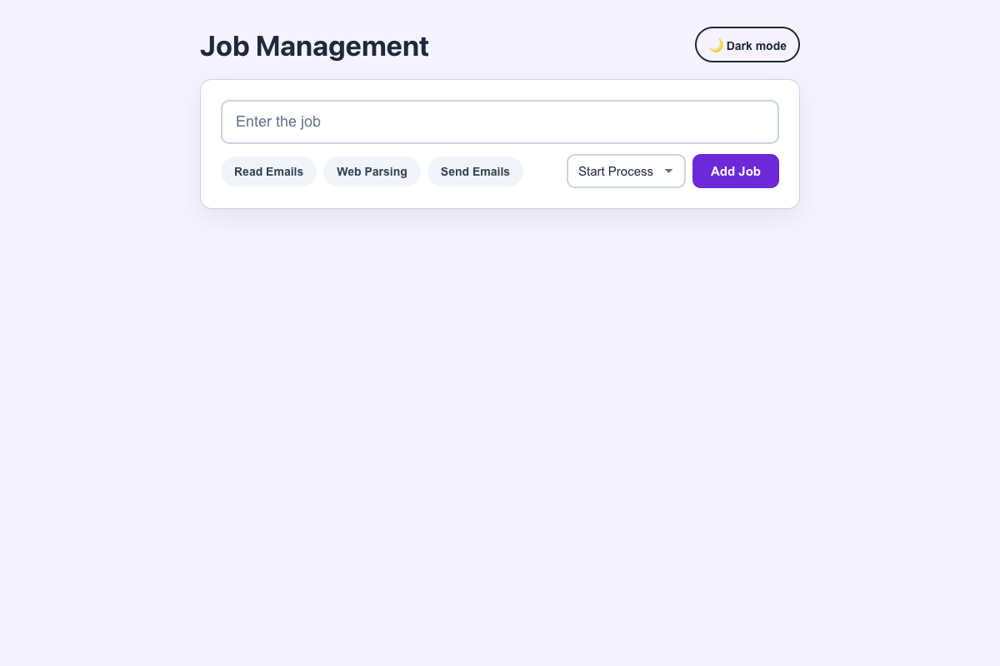

# Practical Activity: Styling the Job Management Application Form

The form from the last activity, fully styled. As the brief asks, the component is now `AppForm` with its own `AppForm.css`, and there's a dark mode.

## Where each task is

All the styles are in `job-form-styled/src/components/AppForm.css`, imported at the top of `AppForm.js`:

| Task | What I did |
|---|---|
| **1. Form container** (`.form-header`) | `max-width: 720px` centred with `margin: 0 auto`, padding, a border, rounded corners and a soft shadow, and flexbox in a column |
| **2. Input** (`.bot-input`) | 18px text, padding, a border and radius, and a `:focus` state with a coloured border and glow |
| **3. Category tags** (`.tag`) | Pill buttons with a light background, a coloured border on `:hover`, a press effect on `:active`, and purple when selected |
| **4. Status dropdown** (`.job-status`) | The browser's default look removed (`appearance: none`), with a CSS arrow and matching border and radius |
| **5. Submit button** (`.submit-data`) | Solid purple with white text (good contrast), plus `:hover`, `:active` and `:focus-visible` states |
| **6. Responsive** | A media query at 600px stacks the tags, the dropdown and the button, and lets the tags fill the width |

**CSS variables:** every colour, radius and gap is a variable on `.form-header` (`--form-accent`, `--form-radius` and so on), so they're set in one place.

## Bonus challenges

1. **Transitions:** tags, the input and the submit button change smoothly. They're turned off for people who prefer reduced motion.
2. **Dark mode:** the toggle in `App.js` adds `app--dark`, which only changes the CSS variables.
3. **CSS Grid:** `.form-details` is a two-column grid, with tags on the left and the status and button on the right.

## Tests and running it

`src/App.test.js` checks the form still works, plus the dark mode toggle. In `job-form-styled`, run `npm install` once, then `npm test` or `npm start`.
