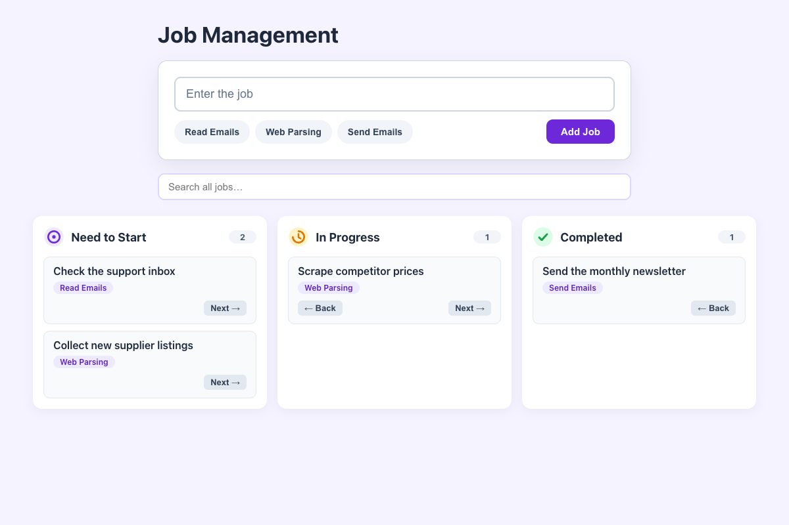

# Practical Activity: Enhancing the Job Management Application with Reusable Components

The Job Management app with a reusable `JobColumn` component, used three times with different props for Need to Start, In Progress and Completed.

## Where each task is

| Task | Where |
|---|---|
| **1. JobColumn** | `src/components/JobColumn.js`: props for `title`, `image`, `jobs` and where jobs can move. It maps the jobs into a list of cards, or shows "No jobs here." |
| **2. App** | `src/App.js`: imports three icons from `src/assets` and renders three `JobColumn`s with a different title, image and jobs |
| **3. Column CSS** | `src/components/JobColumn.css`: the icon and title lined up with flexbox, a job count, and cards. `App.css` puts the columns side by side, stacking below 800px |
| **4. State** | A `jobs` array in `App` (id, title, category, status). Each column gets `jobs.filter((job) => job.status === ...)` |
| **5. Map the jobs** | `jobs.map((job) => <li key={job.id} className="job-card">...)` in `JobColumn` |

## Bonus challenges

1. **Move jobs between columns:** **← Back** and **Next →** on each card change its status.
2. **Add new jobs:** the `AppForm` from the last activity now takes an `onAddJob` prop and adds to Need to Start.
3. **Search:** one search box filters every column by title or category.

## Tests and running it

`src/App.test.js` checks the columns, moving jobs, adding and searching. In `job-manager-components`, run `npm install` once, then `npm test` or `npm start`.
