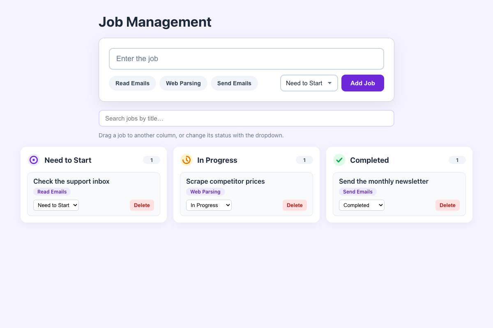

# Practical Activity: Implementing Dynamic Functionality in the Job Management Application

The Job Management app with add, update and delete (CRUD), a status dropdown and a delete button on every job, plus drag-and-drop, search and `localStorage`.

## Where each task is

| Task | Where |
|---|---|
| **1. deleteJob** | `src/App.js`: `setJobs((previous) => previous.filter((job) => job.id !== id))` |
| **2. updateJobStatus** | `src/App.js`: `map` with a copied job `{ ...job, status }` |
| **3. addNewJob** | `src/App.js`: builds a job object and adds it with `[...previous, newJob]` |
| **4. Form** | `src/components/JobForm.js`: title, category, status and **Add Job**, calling `addNewJob` from its props |
| **5. JobStatus** | `src/components/JobStatus.js`: each job card, with a status dropdown (calls `updateJobStatus`) and **Delete** (calls `deleteJob`) |
| **6. Columns** | `App` maps over three column settings and gives each `JobColumn` only the jobs with its status |
| **7. Re-renders** | Every change goes through `setJobs`, which always makes a new array, so React redraws every column that's affected |

State is never changed directly: `filter`, `map` and the spread operator always make new arrays and objects.

## Bonus challenges

1. **Drag and drop:** cards are `draggable`. Columns handle `onDragOver` and `onDrop`, reading the job id and calling `updateJobStatus`. The column you're over gets a dashed outline.
2. **Search:** filters every column by title.
3. **localStorage:** jobs are loaded with `useState(loadJobs)` and saved with `useEffect` whenever `jobs` changes, so they survive a page refresh.

## Tests and running it

`src/App.test.js` checks delete, status updates, adding, drag and drop, search and saving. In `job-manager-dynamic`, run `npm install` once, then `npm test` or `npm start`.
