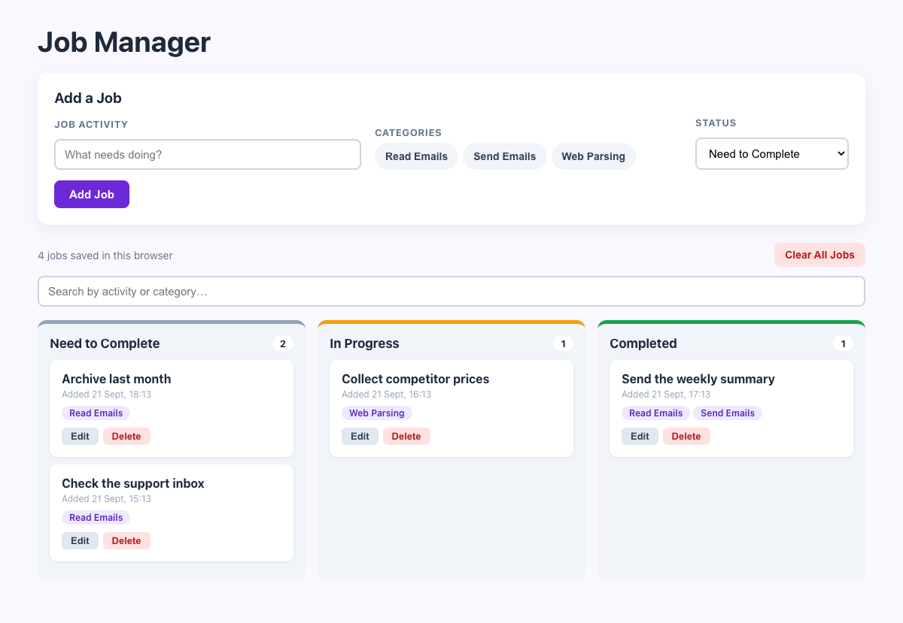

# Practical Activity: Implement Local Storage Persistence with useEffect

The Job Manager, saving every job in the browser with `useEffect`, so the board is still there after a refresh. It also has a **Clear All Jobs** button and timestamps on every job.

## Where each task is

All in `src/components/JobManager.js`:

| Task | Code |
|---|---|
| **1. Start from JobManager** | Built on the last activity's app |
| **2. Import useEffect** | `import React, { useState, useEffect } from 'react';` |
| **3. Load on mount** | `useState(() => { const savedJobs = localStorage.getItem('jobs'); return savedJobs ? JSON.parse(savedJobs) : []; })`. The function only runs on the first render. Broken data falls back to `[]` |
| **4. Save on change** | `useEffect(() => { localStorage.setItem('jobs', JSON.stringify(jobs)); }, [jobs]);` |
| **5. addJob with prevJobs** | `setJobs((prevJobs) => [...prevJobs, newJob])` |
| **6. deleteJob with prevJobs** | `setJobs((prevJobs) => prevJobs.filter((job) => job.id !== jobId))` |
| **7. clearAllJobs** | `setJobs([])` and `localStorage.removeItem('jobs')`, after a confirmation |
| **8. The button** | **Clear All Jobs**, beside a "4 jobs saved in this browser" count |

**The dependency array** `[jobs]` means the effect runs after the first render and again only when `jobs` changes, not on every keystroke in the form.

## Bonus challenges

1. **Edit:** edited jobs are saved by the same effect, because editing changes `jobs`.
2. **Timestamps and sorting:** new jobs get `createdAt: Date.now()`, shown as "Added 23 Sep, 14:05". Each column lists the newest first.
3. **Drag and drop:** drag a card into another column to change its status, and the change is saved too.

## Tests and running it

`src/App.test.js` checks it starts empty, saves and loads jobs, sorts newest first, and that delete and **Clear All Jobs** update storage. In `job-manager-storage`, run `npm install` once, then `npm test` or `npm start`.

To see the saved data, open DevTools (F12), go to **Application**, then **Local storage**, and look at the `jobs` key.
