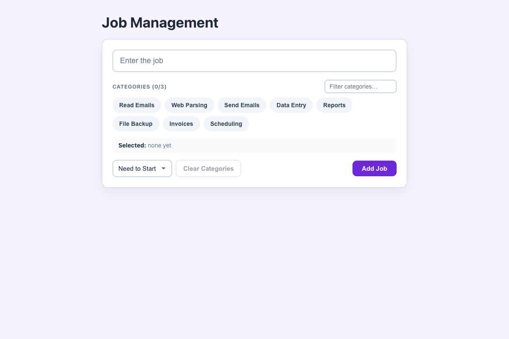

# Practical Activity: Implementing Multi-Select Category Functionality

The job form, now letting you pick several categories at once, with a limit of 3, a category filter and a custom hook.

## Where each task is

| Task | Where |
|---|---|
| **1. handleCategoryToggle** | `src/hooks/useCategorySelection.js`: if the category is selected, `filter` removes it. If not, `[...selected, category]` adds it. Both make a new array |
| **2. Visual feedback** | Selected buttons turn purple with a ✓ and `aria-pressed="true"` |
| **3. The selected list** | A "Selected:" box under the buttons shows each chosen category |
| **4. handleSubmit** | Logs `{ title, categories, status }`, with the categories array |
| **5. Validation** | "Please select at least one category." if none are chosen, and "Please enter a job title." |
| **6. Clear Categories** | Empties the selection. It's disabled when nothing is selected |

## Bonus challenges

1. **Maximum of 3:** the heading shows "Categories (2/3)". At 3, the other buttons are disabled and a message explains why.
2. **Filter the categories:** a small search box narrows the eight categories.
3. **Custom hook:** `useCategorySelection(maxSelected)` returns `selected`, `toggle`, `clear`, `isSelected`, `limitMessage` and `isFull`. Any component can reuse it: `const categories = useCategorySelection(3);`

## Tests and running it

`src/App.test.js` checks toggling, the limit, validation and logging, clearing and filtering. In `multi-select-categories`, run `npm install` once, then `npm test` or `npm start`.
