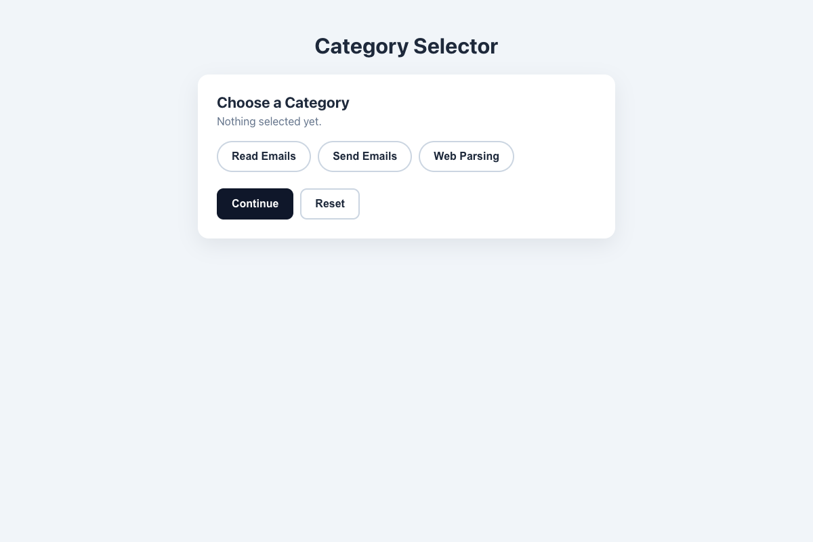

# Practical Activity: Enhance User Interface with Dynamic Category Selection

A `CategorySelector` where the selected button takes its category's colour from a `categoryStyles` object, using inline styles.

## Where each task is

In `category-selector/src/components/CategorySelector.js`:

| Task | Code |
|---|---|
| **1. Component** | `CategorySelector` |
| **2. categoryStyles** | `readEmails` orange, `sendEmails` yellow, `webParsing` blue and `default` white. Each has a text colour that's easy to read on its background (white on blue, dark on orange and yellow) |
| **3. State** | `const [selectedCategory, setSelectedCategory] = useState('')` |
| **4. validateCategory** | `const validateCategory = () => selectedCategory !== ''`, used by the **Continue** button |
| **5. Buttons** | Read Emails, Send Emails and Web Parsing |
| **6. onClick** | Each button calls `handleSelect(key)` |
| **7. Inline styles** | `getButtonStyle(key)` combines a shared base style with `categoryStyles[key]` (selected) or `categoryStyles.default` |
| **8. One at a time** | State holds a single key, so choosing a button replaces the last one |

## Bonus challenges

1. **Reset:** clears the selection.
2. **Transition:** the base style fades the background, text and border colours over 0.3s, and the selected button grows slightly.
3. **Separate button component:** `src/components/CategoryButton.js` renders one button. The parent passes its `style`, `isSelected` and `onSelect`.

## Tests and running it

`src/App.test.js` checks the colours, one-at-a-time selection, `validateCategory` and reset. In `category-selector`, run `npm install` once, then `npm test` or `npm start`.
