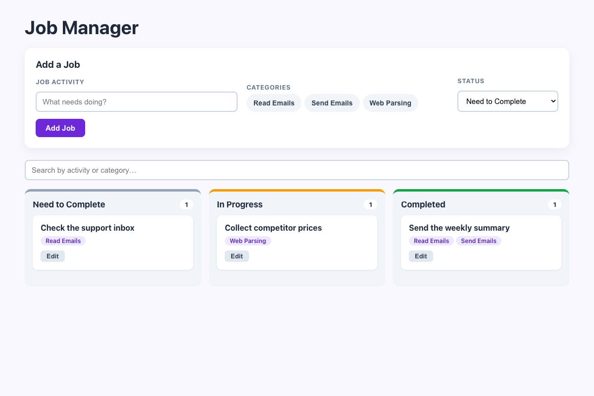

# Practical Activity: Implement a Job Management UI with React

A `JobManager` where you add jobs with an activity, one or more categories and a status. Each job appears as a `JobCard` in the right `JobColumn`.

## Where each task is

| Task | Where |
|---|---|
| **1–2. JobManager and jobs state** | `src/components/JobManager.js`: `const [jobs, setJobs] = useState([...])` |
| **3. Three columns** | "Need to Complete", "In Progress" and "Completed", made by mapping over `STATUSES` |
| **4. The form** | Job activity (text), categories (buttons you can pick several of) and status (dropdown) |
| **5. Adding jobs** | `handleSubmit` checks there's an activity and a category, then `setJobs([...jobs, newJob])` |
| **6. JobColumn** | `src/components/JobColumn.js`: gets `title`, `status` and `jobs` as props, and filters the jobs by status itself |
| **7. JobCard** | `src/components/JobCard.js`: the activity and a tag for each category |
| **8. map** | `columnJobs.map((job) => <JobCard key={job.id} ... />)` |
| **9. Styling** | `src/components/JobManager.css`: a grid form, coloured column tops, cards and tags. It stacks to one column on a phone |

## Bonus challenges

1. **Edit:** **Edit** loads a job into the form. **Save Changes** updates it with `map`.
2. **Drag and drop:** drag a card onto another column to change its status.
3. **Search:** filters by activity or category.

## Tests and running it

`src/App.test.js` checks the columns, adding a job with two categories, editing, drag and drop, and search. In `job-manager-ui`, run `npm install` once, then `npm test` or `npm start`.
