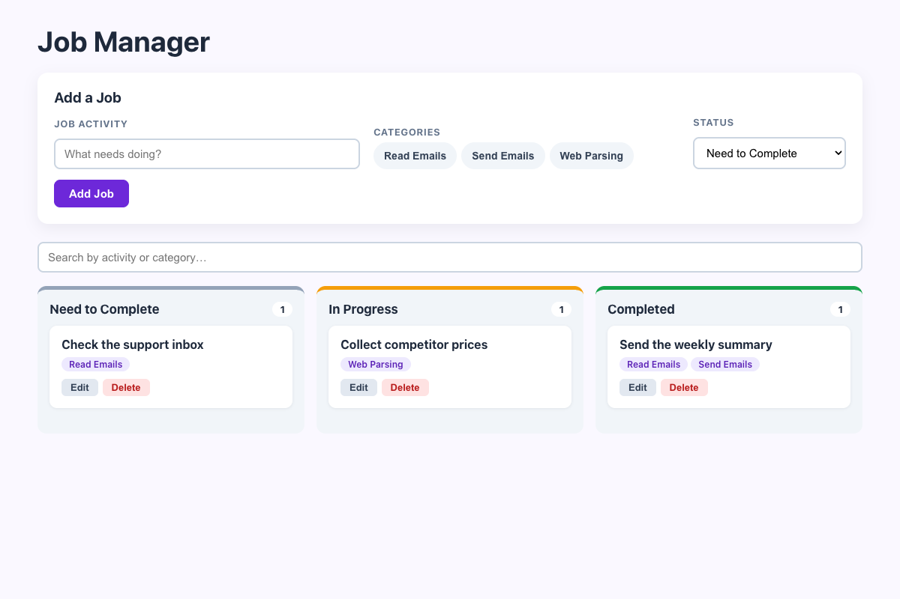

# Practical Activity: Implement Delete Functionality and Form Reset

The Job Manager from the last activity, with a **Delete** button on every job, a form that resets after adding, and jobs saved in `localStorage`.

## Where each task is

| Task | Where |
|---|---|
| **1. Start from JobManager** | Built on the last activity's `JobManager`, `JobColumn` and `JobCard` |
| **2. deleteJob** | `JobManager.js`: `setJobs(jobs.filter((j) => j.id !== jobId))` |
| **3. Pass it to JobColumn** | `<JobColumn ... deleteJob={deleteJob} />` |
| **4. Pass it to JobCard** | `JobColumn` hands it on: `<JobCard ... deleteJob={deleteJob} />` |
| **5. Delete button** | `JobCard.js`: `onClick={() => deleteJob(job.id)}` |
| **6. resetForm** | Sets the activity to `''`, the categories to `[]` and the status to `'Need to Complete'` |
| **7. Reset after adding** | `addJob` builds `{ id: Date.now(), activity, categories, status }`, adds it, then calls `resetForm()` |
| **8. Controlled inputs** | Every input and the select have `value={...}` and `onChange`, so `resetForm` clears them |

The state lives in `JobManager` (it's "lifted up"), and the function travels down through props. That's why a card deep in a column can delete a job.

## Bonus challenges

1. **Edit:** kept from the last activity.
2. **localStorage:** jobs load from `localStorage` when the app starts, and `useEffect` saves them whenever they change.
3. **Confirmation:** `window.confirm('Delete "…"? This can't be undone.')` before deleting.

## Tests and running it

`src/App.test.js` checks deleting with and without confirming, the form reset and saving. In `job-manager-delete`, run `npm install` once, then `npm test` or `npm start`.
