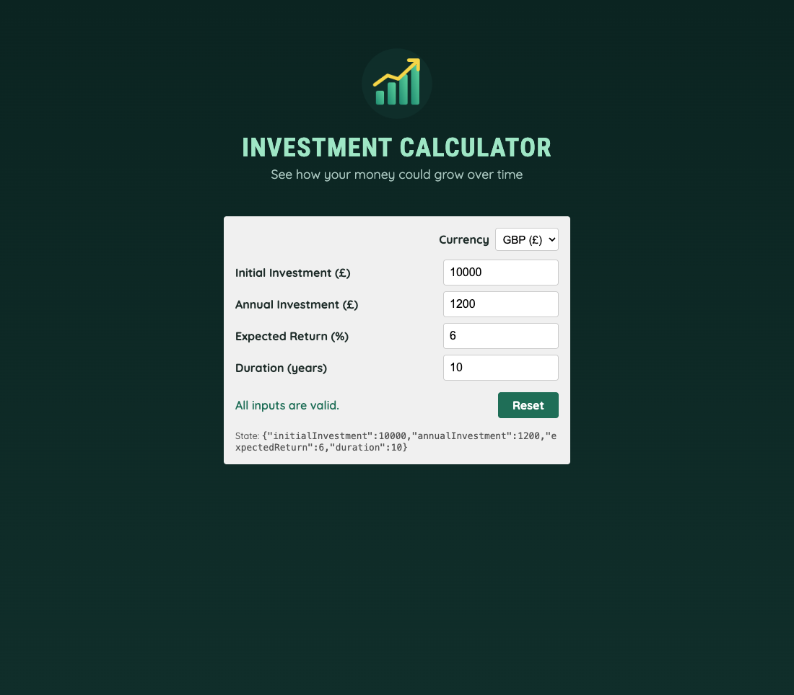

# Practical Activity: Create a User Input Component for an Investment Calculator App

The Money Builder App gets its `UserInput` component: four number inputs bound to one state object, with validation, reset and a currency switch.



## Where each task is

| Task | Where |
|---|---|
| **1–2. UserInput.jsx** | `moneybuilderapp/src/components/UserInput.jsx`, returning `<section id="user-input">` |
| **3. State** | `useState({ initialInvestment: 10000, annualInvestment: 1200, expectedReturn: 6, duration: 10 })` |
| **4. handleChange** | `setUserInput((prevUserInput) => ({ ...prevUserInput, [inputIdentifier]: +newValue }))` |
| **5. The form** | Four `.input-group`s. Each input has `value={userInput[...]}` and `onChange={(e) => handleChange('...', e.target.value)}`: two-way binding |
| **6. App** | `src/App.jsx` renders `<Header />` then `<UserInput />` |
| **7. CSS** | `src/index.css`: the brief's `#user-input` and `.input-group` styles, plus a layout for phones |

**A fix to the brief's code:** the brief's `handleChange` is missing `({` before `...prevUserInput`, so it wouldn't run. Mine returns the new object correctly. An empty box is stored as `''` instead of `0`, so you can clear a field while typing.

A line under the form shows the state as you type, so you can see two-way binding working.

## Bonus challenges

1. **Validation:** each field shows "Required", "Must be positive" or "At least 1 year" underneath, with a red border. A line at the bottom says whether everything is valid.
2. **Reset:** puts all four values back to their starting numbers.
3. **Currency:** a USD / EUR / GBP dropdown changes the symbol in the labels.

## Run it

```text
cd moneybuilderapp
npm install
npm run dev
```
