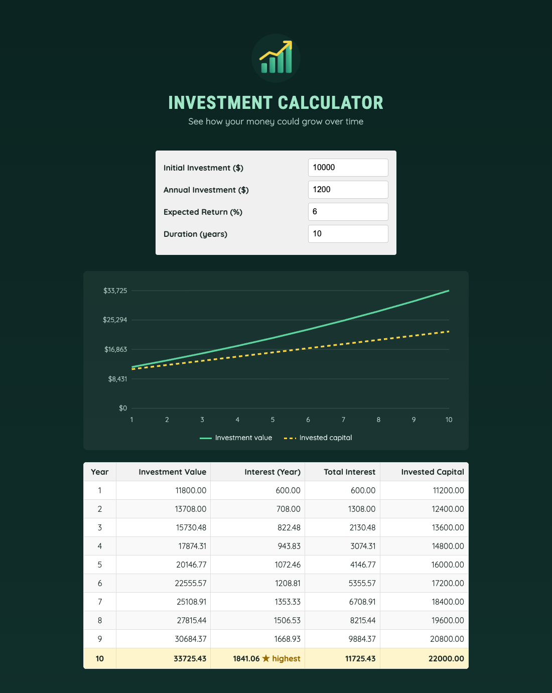

# Practical Activity: Create an Output Component for the Investment Calculator App

The Money Builder App now shows results. The input state has moved up into `App`, so `UserInput` and the new `OutputData` component can share it.



## Where each task is

| Task | Where |
|---|---|
| **1–2. OutputData.jsx** | `src/components/OutputData.jsx`: `({ inputValue })` |
| **3. The calculation** | `calculateInvestmentResults({ initialInvestment: +inputValue.initialInvestment, ... })` |
| **4. The table** | Year, Investment Value, Interest (Year), Total Interest and Invested Capital, each shown with `.toFixed(2)` |
| **5. App** | `src/App.jsx` holds `userInput` and `handleInputChange`, and passes them to `<UserInput userInput={userInput} onInputChange={handleInputChange} />` and `<OutputData inputValue={userInput} />` |
| **6. CSS** | The brief's table styles in `src/index.css` |

**Matching the calculation's fields:** `calculateInvestmentResults` returns `valueEndOfYear`, `interest` and `annualInvestment`, not the `investmentValue`, `totalInterest` and `investedCapital` the table uses. `OutputData` works those out:
- invested capital = initial investment + annual investment × year
- total interest = value − invested capital

## Bonus challenges

1. **Invalid input:** empty or negative values, or a duration under 1, show a list of what to fix instead of the table.
2. **Highest interest:** the row with the most interest is highlighted with "★ highest".
3. **Chart:** `src/components/GrowthChart.jsx` draws the investment value and invested capital as an SVG line chart, with no extra library. It has a text description for screen readers.

## Run it

```text
cd moneybuilderapp
npm install
npm run dev
```
