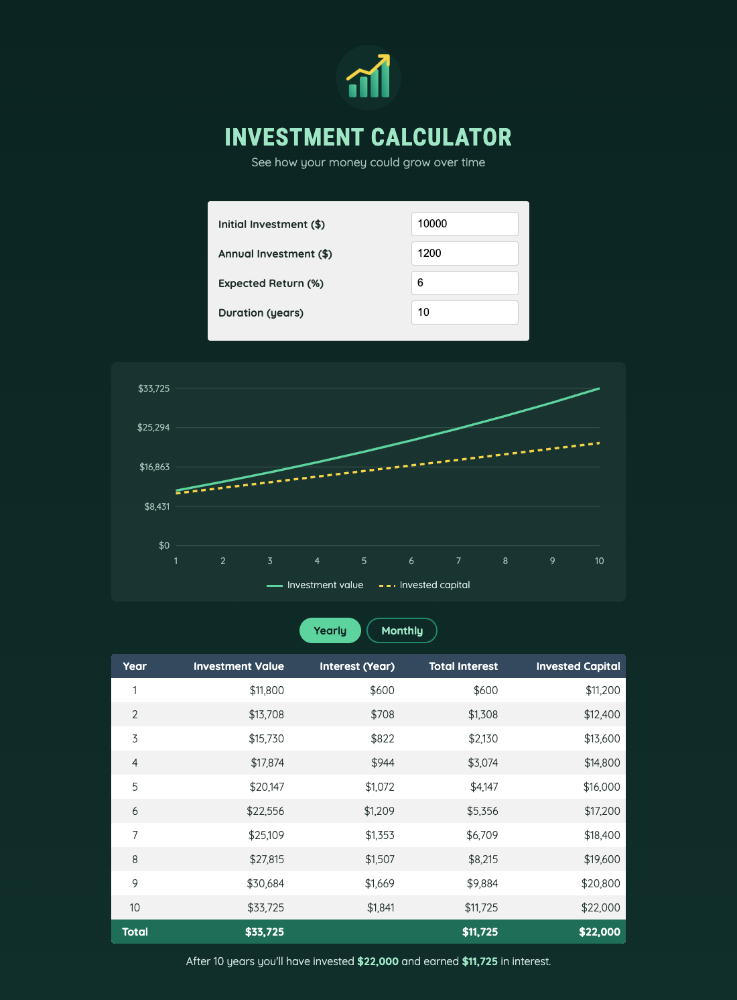

# Practical Activity: Implement a Results Table for the Investment Calculator App

The Money Builder App's results table, following the brief's code: currency formatting, total interest and invested capital worked out for each year, and a message for a zero duration.



## Where each task is

In `src/components/OutputData.jsx`:

| Task | Code |
|---|---|
| **1. Table structure** | `<table id="result">`, imports `calculateInvestmentResults` and `formatter` |
| **2. Rows** | Inside the map: `totalInterest = valueEndOfYear − annualInvestment × year − initialInvestment` and `totalAmountInvested = valueEndOfYear − totalInterest`, all shown with `formatter.format(...)` |
| **3. CSS** | `#result` in `src/index.css`: dark `#34495e` header, striped rows, right-aligned numbers. The header stays visible while the table scrolls |
| **4. App** | Passes `userInput` to `<OutputData inputValue={userInput} />` |
| **5. Errors** | `if (inputValue.duration <= 0)` returns "Please enter a duration greater than zero." There's also a message for empty or negative fields |

## Bonus challenges

1. **Summary:** a **Total** row at the bottom of the table (`<tfoot>`), plus a sentence: "After 10 years you'll have invested $22,000 and earned $11,725 in interest."
2. **Yearly / Monthly:** `calculateMonthlyResults()` in `src/util/investment.js` shows every month. The yearly return is split into 12 monthly returns, and the annual investment into 12 payments. Because the interest compounds every month, the monthly totals end slightly higher than the yearly ones ($34,582 against $33,725 for the default inputs).
3. **Line chart:** the SVG chart from the last activity.

## Run it

```text
cd moneybuilderapp
npm install
npm run dev
```
