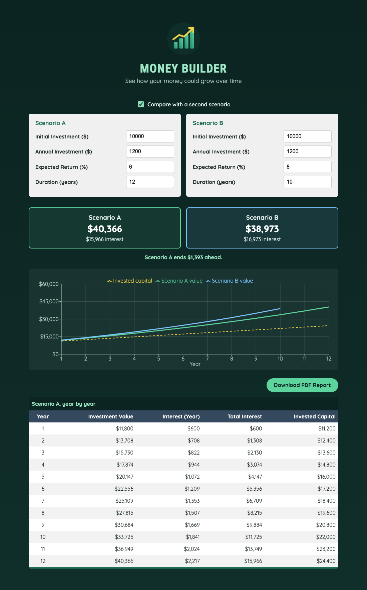

# Practical Activity: Enhancing the Investment Calculator

The finished Money Builder App: validation, error messages, a downloadable PDF report, `useMemo` and `useCallback`, a loading state, a `recharts` chart, and a second scenario to compare.



## Where each task is

| Task | Where |
|---|---|
| **1. Input validation** | `validate()` in `src/App.jsx` requires every field and a duration of at least 1 year. The change handler refuses negative numbers and says why ("Annual investment can't be negative.") |
| **2. Error handling** | An `errors` state object, updated in a `useEffect` whenever the inputs change. Errors show under each field and in a red banner. The results and the Download button are hidden until the inputs are valid, and the errors clear on their own |
| **3. PDF report** | `npm install jspdf`. `src/util/generateReport.js` exports `generatePDF()`, which writes a titled report with the inputs, a striped table and a summary, then downloads `investment-report.pdf`. The **Download PDF Report** button only shows when there are results |
| **4. Styling** | Red error text and borders, a two-column layout when comparing, and hover effects on the inputs, table rows and download button |
| **5. Performance** | `useMemo` recalculates the rows only when the calculated inputs change. `useCallback` keeps the download handler the same between renders. A `setTimeout` shows "Calculating…" for 0.4s, with a clean-up that cancels it if you keep typing |

**Faster first load:** the PDF library is big, so it's loaded only when the button is first clicked, with `await import('./util/generateReport')`.

## Bonus challenges

1. **recharts chart:** `npm install recharts`. `src/components/InvestmentChart.jsx` draws the value and invested capital with a tooltip and legend.
2. **Compare scenarios:** tick "Compare with a second scenario" to get Scenario B's inputs beside Scenario A. You'll see both final values, which one ends ahead and by how much, and B's line on the chart.

## What I tested

In Chrome: the loading state, refusing negatives, the empty-field error hiding the Download button, the errors clearing, a real PDF downloading, and comparison mode with three chart lines. There were no console errors.

## Run it

```text
cd moneybuilderapp
npm install
npm run dev
```

`npm run build` warns that the main file is over 500 kB. That's mostly `recharts`. It's a suggestion, not an error.
