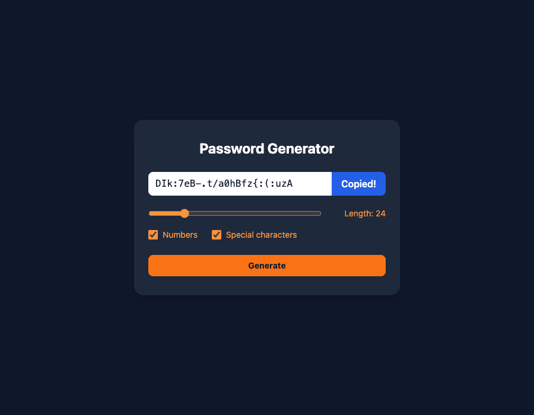

# Practical Activity: Setting Up a Password Generator

A new Vite and Tailwind CSS project with a `PasswordGenerator` component: the state, a length slider, two checkboxes, and the bonus Generate and Copy buttons.



## Task 1: Setup

```text
npm create vite@latest password-generator -- --template react
cd password-generator
npm install
npm install -D tailwindcss@3 postcss autoprefixer
npx tailwindcss init -p
```

`tailwind.config.js` lists `./index.html` and `./src/**/*.{js,ts,jsx,tsx}` in `content`, and `src/index.css` has the three `@tailwind` directives. Tailwind 3 is used because `npx tailwindcss init -p` is a Tailwind 3 command.

## Where each task is

| Task | Where |
|---|---|
| **2. PasswordGenerator.jsx** | `src/PasswordGenerator.jsx` |
| **3. State** | `length` (10), `numberAllowed` (false), `characterAllowed` (false) and `password` (`''`), all with `useState` |
| **4. UI** | A read-only password box with a Copy button, a range slider (6–100) showing "Length: 10", and Numbers and Special characters checkboxes. Everything is bound to state and styled with Tailwind |
| **5. App.jsx** | The default content is removed, and it renders `<PasswordGenerator />` on a dark background |
| **6. Test** | `npm run dev`. The slider and checkboxes update the state |

## Bonus challenges

1. **Generation:** **Generate** builds a password of the chosen length from letters, plus numbers and symbols when ticked. It uses `crypto.getRandomValues()`, the browser's secure random number generator, because `Math.random()` isn't designed for security.
2. **Copy to clipboard:** `navigator.clipboard.writeText(password)`. The button says "Copied!" for a moment.

## Run it

```text
cd password-generator
npm install
npm run dev
```
