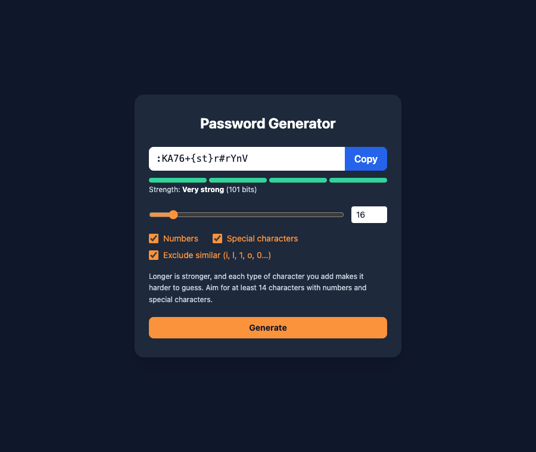

# Practical Activity: Implementing Password Generator Functionality

The password generator's logic, built with `useCallback`, plus button feedback, length checks, strength help and all three bonuses.



## Where each task is

| Task | Where |
|---|---|
| **1. passwordGenerator with useCallback** | `src/PasswordGenerator.jsx` |
| **2. Controls** | A **Generate** button, a length range (with a number box beside it), and Numbers and Special characters checkboxes, each connected to its state |
| **3. Character sets** | Letters are always used, and numbers and symbols are added when ticked. `createPassword()` in `src/utils/password.js` **always includes at least one character from every chosen set**, then shuffles, so the guaranteed ones aren't always first |
| **4. Dependencies** | `[length, numberAllowed, characterAllowed, excludeSimilar]`: everything the function reads. The setters don't need listing |
| **5. User experience** | The button turns green and says "✓ Generated" for a moment. The length must be a whole number from 6 to 100: anything else shows an error and disables Generate. Help text explains what makes a password strong |

## Bonus challenges

1. **Strength meter:** `src/components/StrengthMeter.jsx` shows four bars and a label (Weak, Fair, Strong, Very strong) worked out from the length and how many different characters are possible. It updates as soon as an option changes.
2. **Exclude similar characters:** removes i, l, L, I, 1, o, O, 0 and |.
3. **Copy to clipboard**, with "Copied!" feedback.

**Randomness:** every character comes from `crypto.getRandomValues()`, the browser's secure random number generator.

## Run it

```text
cd password-generator
npm install
npm run dev
```
