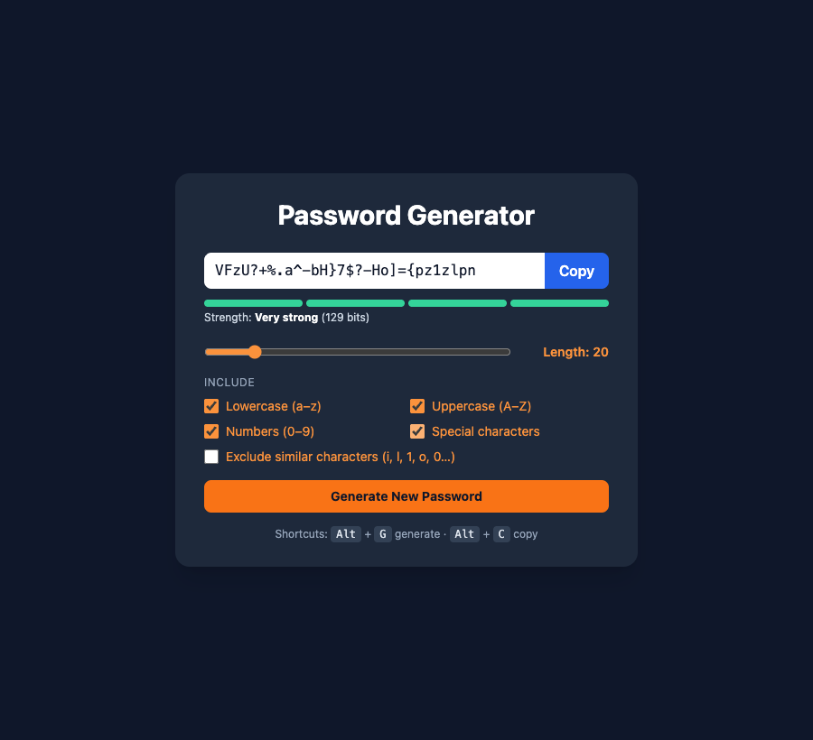

# Practical Activity: Implementing Password Generator UI and Functionality

The full password generator interface: a length slider, a checkbox for each type of character, a Copy button, a new password on every change, validation, and all three bonuses.



## Where each task is

All in `src/PasswordGenerator.jsx`:

| Task | What I did |
|---|---|
| **1. Length control** | A range input from 6 to 100, connected to `length`, with "Length: 16" beside it |
| **2. Checkboxes** | `numberAllowed` and `characterAllowed` as the brief asks, plus lowercase and uppercase, so every type can be turned off (needed for Task 6) |
| **3. Copy** | `copyPasswordToClipboard` uses `navigator.clipboard.writeText`. The button turns green and says "Copied!" |
| **4. Styling** | Tailwind throughout. It's responsive: the checkboxes are one column on a phone and two on a wider screen, and the padding and heading size grow on larger screens |
| **5. Connected to the generator** | `passwordGenerator` (a `useCallback`) uses the current length and options. A `useEffect` calls it whenever it changes, so every change makes a new password |
| **6. Validation** | The length is always kept between 6 and 100. With no types chosen, it shows "Choose at least one type of character." and clears the password |

## Bonus challenges

1. **Strength indicator:** updates in real time.
2. **Exclude similar characters:** a checkbox.
3. **Keyboard shortcuts:** <kbd>Alt</kbd>+<kbd>G</kbd> generates and <kbd>Alt</kbd>+<kbd>C</kbd> copies. It uses `event.code`, because on a Mac, Option+G types a symbol. The listener is removed in the effect's clean-up.

## Run it

```text
cd password-generator
npm install
npm run dev
```
