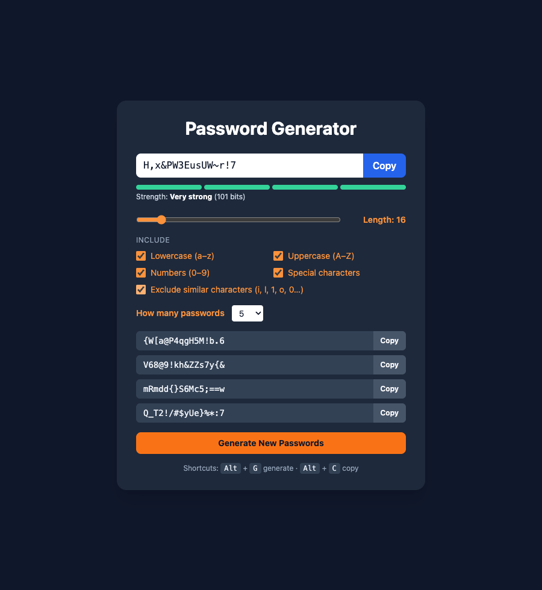

# Practical Activity: Advanced Password Generator Implementation

The finished password generator. The logic lives in a custom hook, `usePasswordGenerator`, and the component uses `useRef` to select the password when copying. It can also make several passwords at once.



## Where each task is

| Task | Where |
|---|---|
| **1. useEffect** | `src/hooks/usePasswordGenerator.js`: `useEffect(() => { passwordGenerator(); }, [passwordGenerator]);`. It runs whenever the length or an option changes, because that's when `passwordGenerator` changes |
| **2. useCallback** | `passwordGenerator` depends on `[length, options, excludeSimilar, count]` |
| **3. useRef copy** | `src/PasswordGenerator.jsx`: `passwordRef = useRef(null)` on the input. `copyPasswordToClipboard` (a `useCallback` on `[password]`) calls `passwordRef.current.select()`, then `navigator.clipboard.writeText(password)` |
| **4. User experience** | The Copy button turns green with "Copied!". There's an error when no types are chosen, and a live strength indicator |
| **5. Custom hook** | `usePasswordGenerator()` holds all the state, the generator and the effect, and returns what the component needs |

### Why useCallback helps here

The `useEffect` depends on `passwordGenerator`. Without `useCallback`, a new `passwordGenerator` would be made on every render, the effect would see a "different" function every time, and it would make a new password after every render, including the render caused by typing into another field. With `useCallback`, the function only changes when its dependencies do, so the effect only runs when it should.

### Why a custom hook helps

- The component only deals with how things look. It's shorter and easier to read.
- The password logic can be reused in another component, or tested on its own.
- The rules of hooks still apply inside it: the hook calls `useState`, `useCallback` and `useEffect` at its top level.

## Bonus challenges

1. **Exclude similar characters:** a checkbox.
2. **Several passwords:** choose 1, 3, 5 or 10. The first goes in the main box, and the rest are listed, each with its own Copy button.
3. **Keyboard shortcuts:** <kbd>Alt</kbd>+<kbd>G</kbd> and <kbd>Alt</kbd>+<kbd>C</kbd>.

## Run it

```text
cd password-generator
npm install
npm run dev
```
