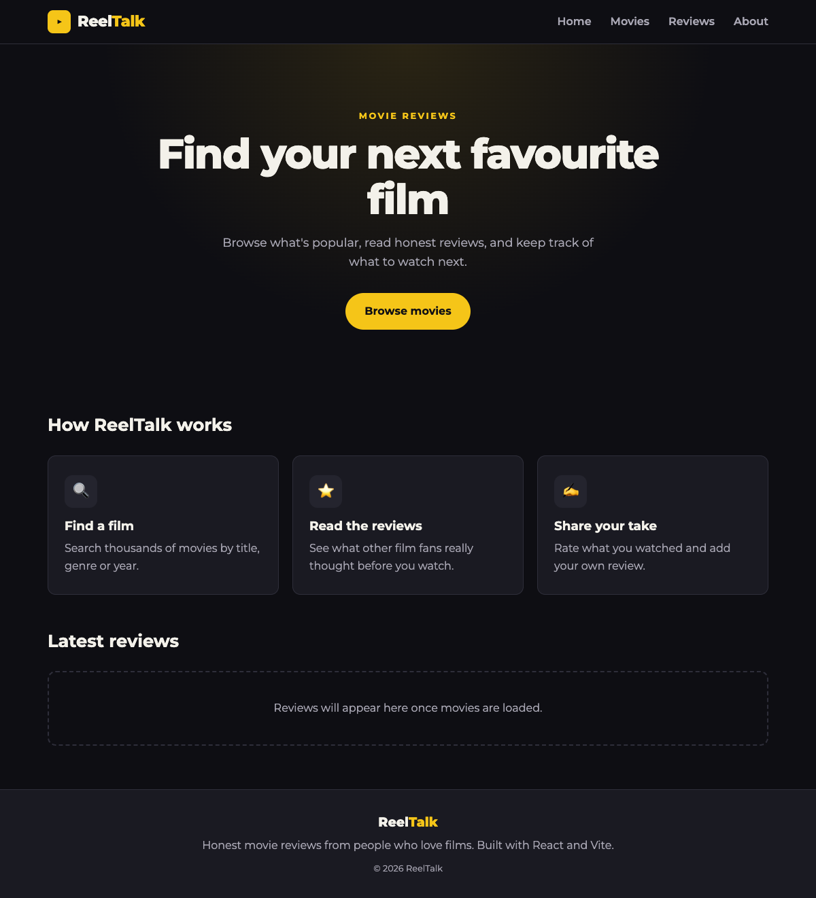
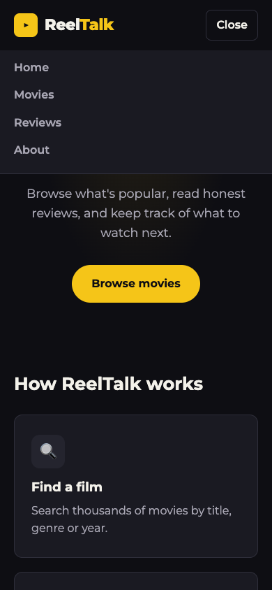

# Practical Activity: Setting Up a Movie Review Application

The start of **ReelTalk**, a movie review app. It's a Vite React project with a cleaned-up starter, a navbar and main layout styled with CSS Modules, the Montserrat font stored in the project as WOFF files, a `Header` and a `Footer`.

| Desktop | Phone, menu open |
|---|---|
|  |  |

## Where each task is

| Task | What I did |
|---|---|
| **1. New project** | `npm create vite@latest movie-review-app -- --template react`, then `npm install` |
| **2. Clean up** | Removed the demo counter, logos and `App.css`. `index.css` now only has the fonts, colour variables and base styles |
| **3. Layout** | `App.jsx`: `Header`, then `<main>` (a hero and two sections), then `Footer`. Styled with **CSS Modules** (`App.module.css`, `Header.module.css`, `Footer.module.css`), so each component's class names can't clash |
| **4. Custom font** | Montserrat in four weights (400, 600, 700 and 800) in `src/assets/fonts` as `.woff` files, each declared with `@font-face` in `index.css`. `body` uses `'Montserrat', sans-serif` |
| **5. components folder** | `src/components`, with the plan below |
| **6. Header** | `src/components/Header.jsx`: the ReelTalk logo and links to Home, Movies, Reviews and About, made from an array. It stays at the top while you scroll |

**About the font files:** instead of converting on transfonter.org, I downloaded Montserrat's official WOFF files straight from Google Fonts, which is the same result. Montserrat is free under the SIL Open Font License, which asks for the licence to be included with the fonts, so it's in `src/assets/fonts/OFL.txt`.

## Component plan (Task 5)

| Component | Job | Status |
|---|---|---|
| `Header` | Logo and navigation | Done |
| `Footer` | About text and copyright | Done (bonus) |
| `SearchBar` | Search movies by title | Next |
| `GenreFilter` | Buttons to show one genre | Next |
| `MovieList` | Lay the movie cards out in a grid | Next |
| `MovieCard` | One movie: poster, title, year and rating | Next |
| `MovieDetails` | A movie's full information and reviews | Later |

## Bonus challenges

1. **Responsive design:** the "How it works" cards use CSS Grid (three columns, or one on a phone). On narrow screens the header's links fold into a **Menu** button (with `aria-expanded`).
2. **Colour scheme:** a dark cinema theme with a gold accent, set once as CSS variables in `index.css` (`--colour-accent` and so on) and used by every component.
3. **Footer:** `src/components/Footer.jsx`.

## Run it

```text
cd movie-review-app
npm install
npm run dev
```
